# EUDI rQES CSC library

:heavy_exclamation_mark: **Important!** Before you proceed, please read
the [EUDI Wallet Reference Implementation project description](https://github.com/eu-digital-identity-wallet/.github/blob/main/profile/reference-implementation.md)

[](https://www.apache.org/licenses/LICENSE-2.0)

## Table of contents

* [Overview](#overview)
* [Implemented features](#implemented-features)
* [Interactions between the library, the caller and the RSSP](#interactions-between-the-library-the-caller-and-the-rssp)
* [Document Retrieval flow](#document-retrieval-flow)
* [Disclaimer](#disclaimer)
* [How to contribute](#how-to-contribute)
* [License](#license)

## Overview

This is a Kotlin library, targeting JVM, that supports
the [Cloud Signature Consortium API (version 2)](https://cloudsignatureconsortium.org/wp-content/uploads/2023/04/csc-api-v2.0.0.2.pdf)
protocol.

See [CHANGELOG.md](./CHANGELOG.md) for the latest updates.

## Implemented features

The library supports the following remote service API endpoints:

| Method                        | Support |
|-------------------------------|---------|
| info                          | ✅       |
| auth/login                    | ❌       |
| auth/revoke                   | ❌       |
| credentials/list              | ✅       |
| credentials/info              | ✅       |
| credentials/authorize         | ❌       |
| credentials/authorizeCheck    | ❌       |
| credentials/getChallenge      | ❌       |
| credentials/extendTransaction | ❌       |
| signatures/signHash           | ✅       |
| signatures/signDoc            | ❌       |
| signatures/signPolling        | ❌       |
| signatures/timestamp          | ❌       |

Additionally, the library supports the following authorization methods:

|            | OAuth 2.0 | Explicit |
|------------|-----------|----------|
| Service    | ✅         | ❌        |
| Credential | ✅         | ❌        | 

### ❗Important note on hash calculation and signature embedding

This library is exposing methods for calculating a document's digest and for embedding a signature to the document. 
However, this functionality is not implemented in the library itself, but is delegated to an external component.   
This component is not part of the library and must be provided by the library consumer. Alternative, the library consumer 
can implement the hash calculation and signature embedding logic in their own application.

In future versions of the library, this functionality may be implemented directly in the library.

## Interactions between the library, the caller and the RSSP

### Legend

| Symbol     | Description                                                                         |
|------------|-------------------------------------------------------------------------------------|
| Caller     | The application that is using the library to interact with the RSSP                 |
| Lib        | This library                                                                        |
| RSSP       | The Remote Signing Service Provider                                                 |
| Remote SCA | A remote component that is responsible for hash calculation and signature embedding |

### Get RSSP information

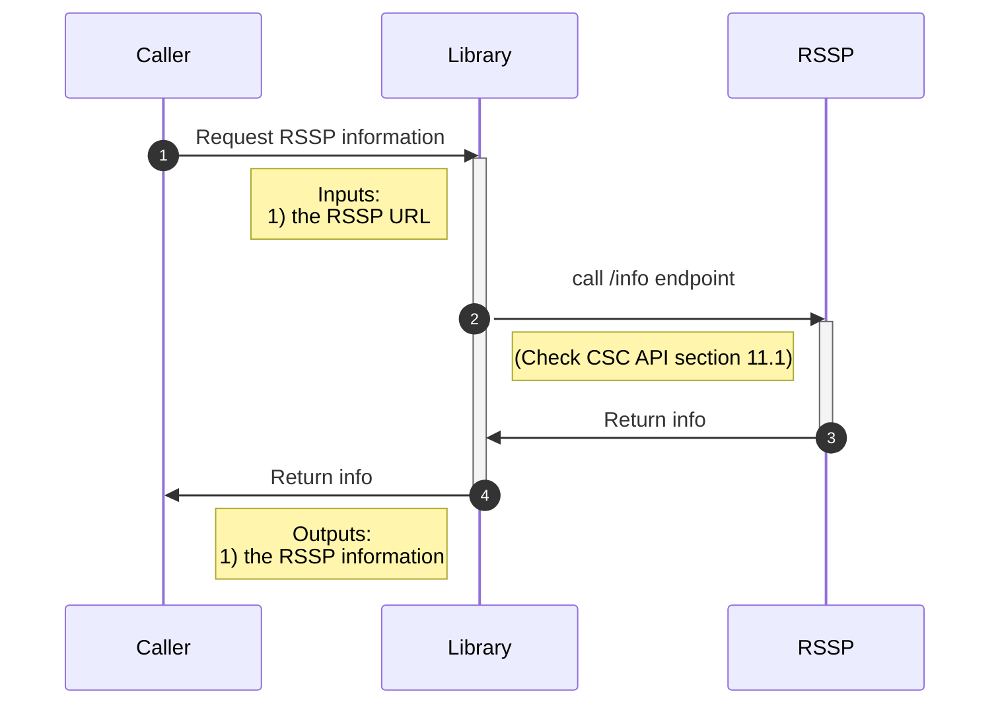

### Service authorization

#### Authorization Code flow

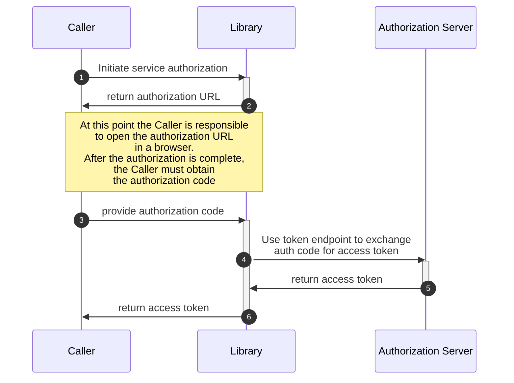

#### Authorization Code flow with Pushed Authorization Requests (PAR)

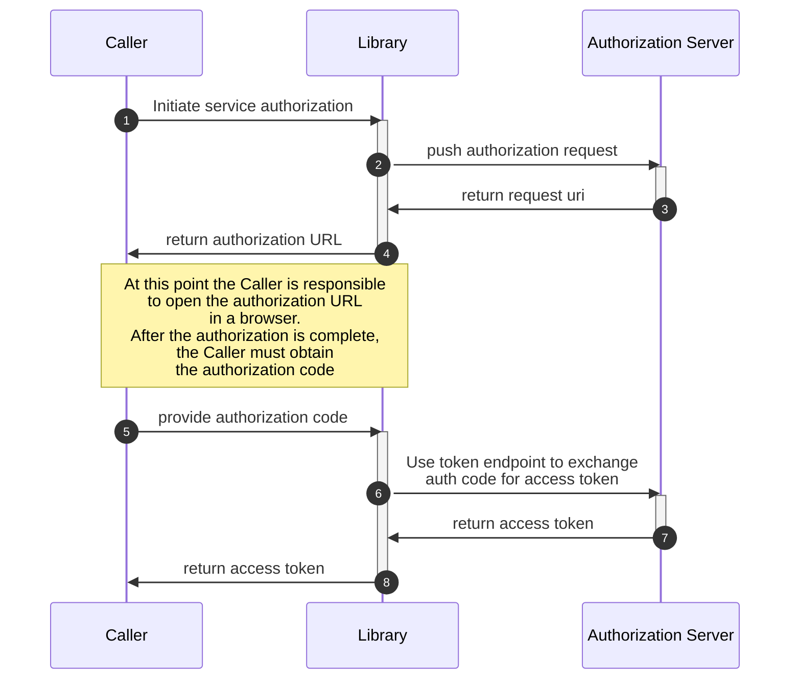

### Credentials list

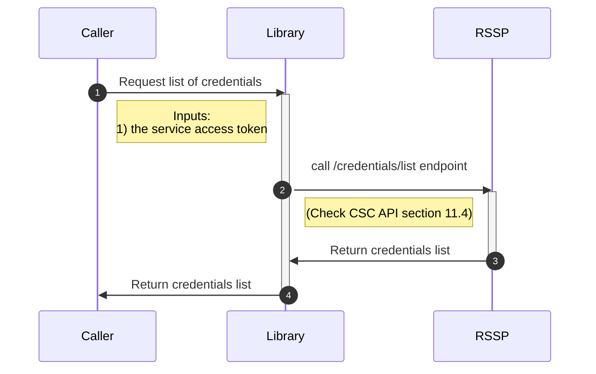

### Credentials info

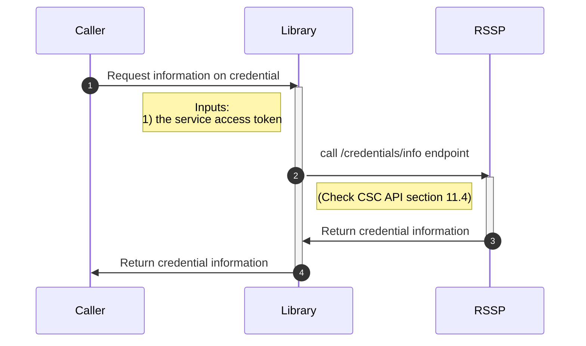

### Credential Authorization flow

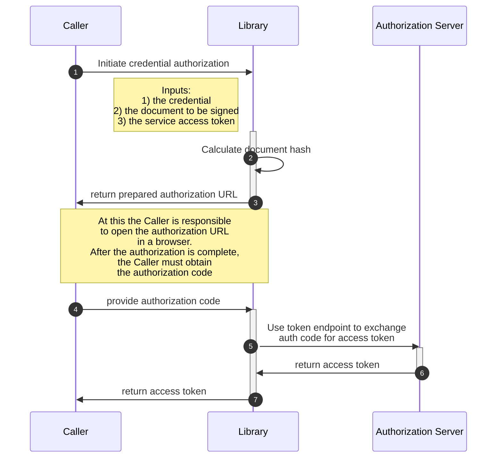

### Credential Authorization flow with remote SCA

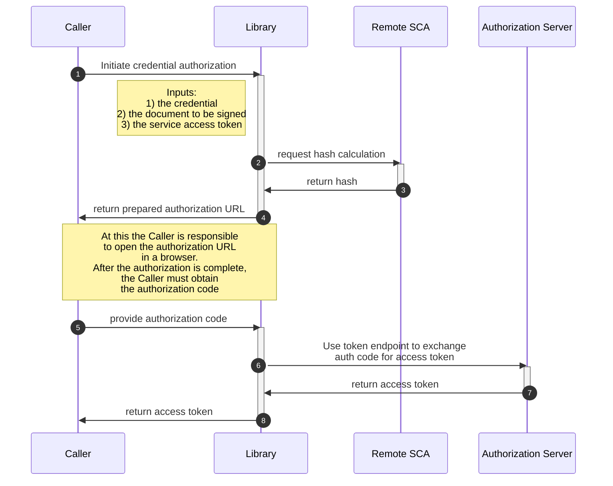

### Hash signing

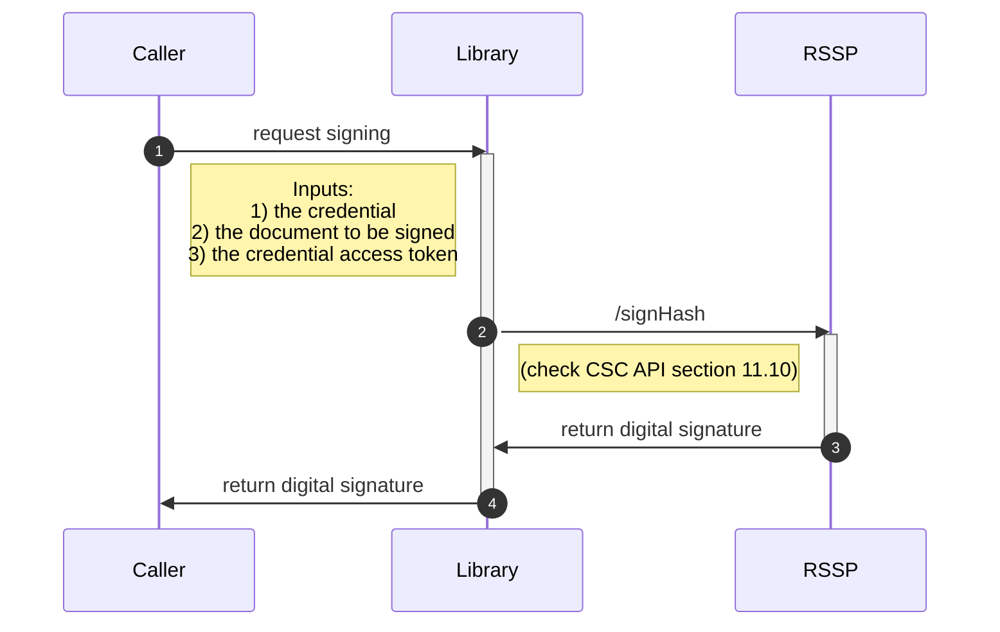

## Document Retrieval flow

> [!WARNING]
> This flow is not part of the CSC API specification and may be removed in future versions of the library.

This library is also implementing a flow call Document Retrieval, that allows a Relying Party (RP) to communicate to the Caller the locations of documents to be signed.
It also provides a way for the Caller to provide the signed documents or signatures back to the RP.
This flow resembles a Verifiable Presentation flow.

The interactions with the RP happen via the DocumentRetrieval client, which is a separate client from the main client that interacts with the RSSP.

### How to initiate the document retrieval client

```kotlin
val config = DocumentRetrievalConfig(
    jarConfiguration = JarConfiguration(
        supportedAlgorithms = listOf(JWSAlgorithm.ES256),
    ),
    clock = Clock.systemDefaultZone(),
    jarClockSkew = Duration.ofSeconds(15L),
    supportedClientIdSchemes = listOf(
        SupportedClientIdScheme.X509SanUri.NoValidation,
        SupportedClientIdScheme.X509SanDns.NoValidation,
    ),
)

val client = DocumentRetrieval(config)
```

### Document Retrieval

The Caller must first acquire a request URI from the RP, usually by scanning a QR code. The request URI is then provided to the Library, which will retrieve the request object from the RP:

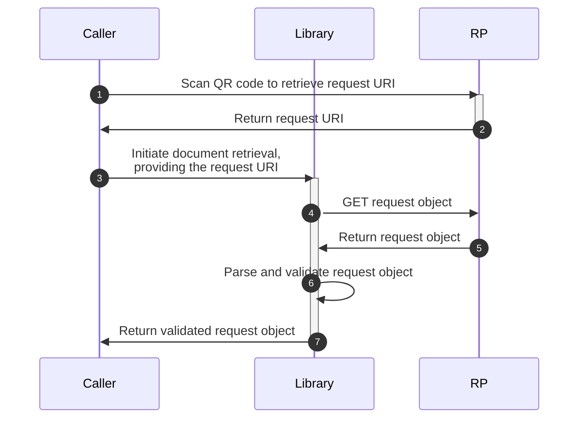

Given that the Caller has obtained a request URI from the RP, the Document Retrieval flow can be initiated as follows:

```kotlin
with(client) {
    val resolution = resolveRequestUri(requestUri)
}
```

The `resolution` object contains a validated request object. It contains information about the documents locations, the document hashes as well as the access method for the retrieval of the documents.

The Caller can now download the documents, compute theis hashes, and compare them with the hashes in the request object in order to ensure the integrity of the documents:

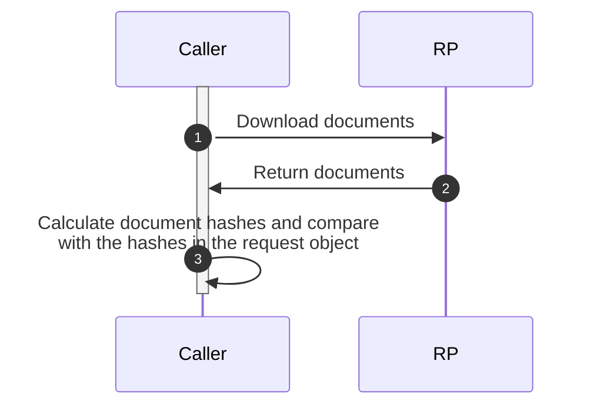

### Dispatch signed documents

The Caller can now start the signing flow as described in the previous section. After completion, the Caller can now communicate the signed documents or signatures back to the RP:

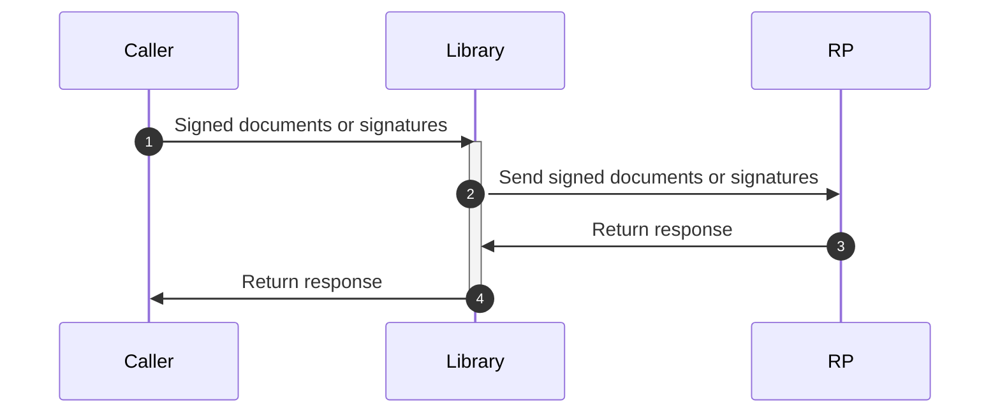


To send the signed documents back to the RP, the Caller can use the `dispatch` method, as follows:

```kotlin
with(client) {
    dispatch(
        resolution.requestObject,
        Consensus.Positive(
            documentWithSignature = signedDocuments.map { it.readAllBytes().decodeToString() },
            signatureObject = signatureList.signatures.map { it.value },
        ),
    )
}
```

> [!TIP]
> A code example of how to use the Document Retrieval flow can be found in the [DocumentRetrievalFlowTest](src/test/kotlin/DocumentRetrievalExample.kt) file.

## Disclaimer

The released software is an initial development release version:
-  The initial development release is an early endeavor reflecting the efforts of a short timeboxed period, and by no means can be considered as the final product.
-  The initial development release may be changed substantially over time, might introduce new features but also may change or remove existing ones, potentially breaking compatibility with your existing code.
-  The initial development release is limited in functional scope.
-  The initial development release may contain errors or design flaws and other problems that could cause system or other failures and data loss.
-  The initial development release has reduced security, privacy, availability, and reliability standards relative to future releases. This could make the software slower, less reliable, or more vulnerable to attacks than mature software.
-  The initial development release is not yet comprehensively documented.
-  Users of the software must perform sufficient engineering and additional testing in order to properly evaluate their application and determine whether any of the open-sourced components is suitable for use in that application.
-  We strongly recommend to not put this version of the software into production use.
-  Only the latest version of the software will be supported

## How to contribute

We welcome contributions to this project. To ensure that the process is smooth for everyone
involved, follow the guidelines found in [CONTRIBUTING.md](CONTRIBUTING.md).

## License

### Third-party component licenses

* OAUTH2 & OIDC Support: [Nimbus OAuth 2.0 SDK with OpenID Connect extensions](https://connect2id.com/products/nimbus-oauth-openid-connect-sdk)
* Http Client: [Ktor](https://ktor.io/)
* Json: [Kotlinx Serialization](https://github.com/Kotlin/kotlinx.serialization)

### License details

Copyright (c) 2024 European Commission

Licensed under the Apache License, Version 2.0 (the "License");
you may not use this file except in compliance with the License.
You may obtain a copy of the License at

    http://www.apache.org/licenses/LICENSE-2.0

Unless required by applicable law or agreed to in writing, software
distributed under the License is distributed on an "AS IS" BASIS,
WITHOUT WARRANTIES OR CONDITIONS OF ANY KIND, either express or implied.
See the License for the specific language governing permissions and
limitations under the License.
